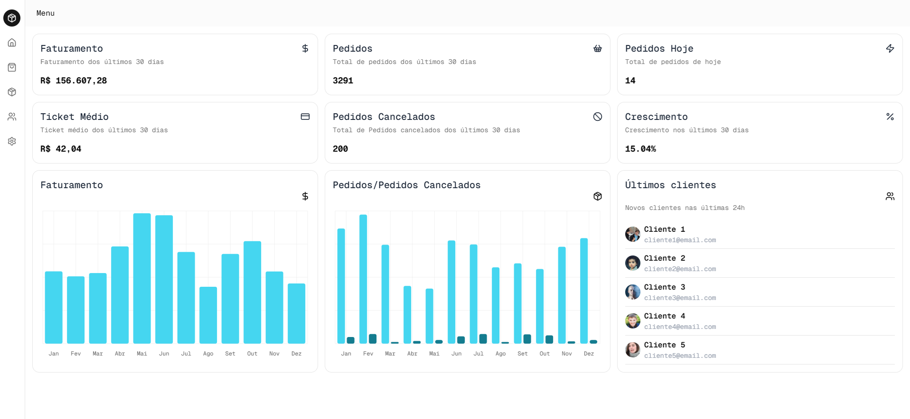
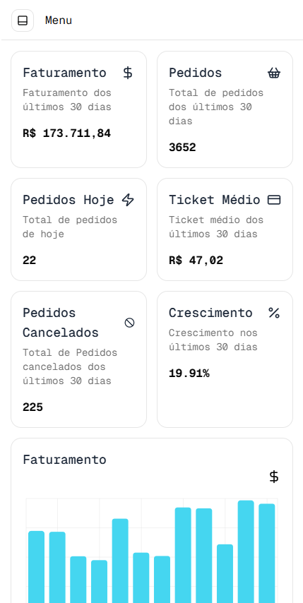
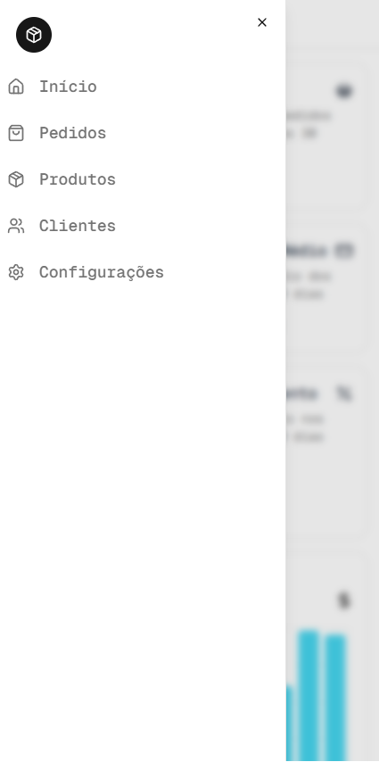

# Dashboard de Vendas

## Sobre o projeto

Esse projeto é um dashboard desenvolvido com foco na visualização de dados de vendas, apresentando métricas importantes como faturamento, pedidos e desempenho geral.

---

## Status do Projeto

Esse projeto ainda está em desenvolvimento.

Algumas funcionalidades ainda estão sendo implementadas.

---

## Tecnologias utilizadas

* React
* Next.js
* TypeScript
* Tailwind
* Lucide React
* Shadcn UI

---

## 📸 Preview

### Versão Desktop

### Versão Mobile

---

## Funcionalidades

* Dashboard com métricas principais
* Cards de resumo (vendas, pedidos, etc)
* Integração com API simulada
* Gráficos dinâmicos

